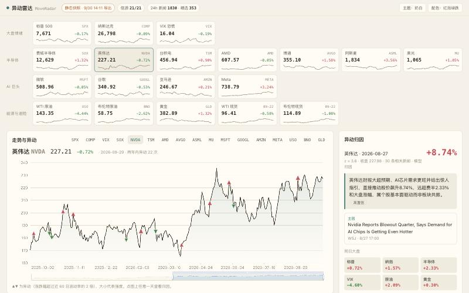
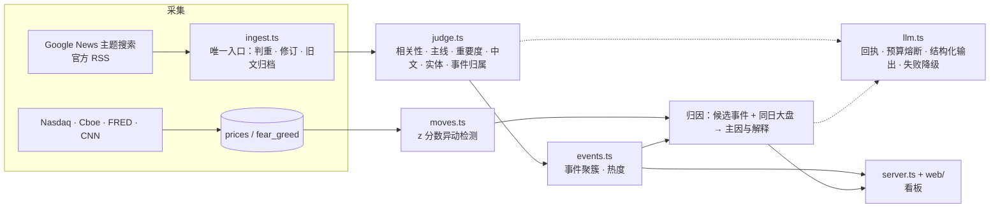

# 异动雷达 MoveRadar

**盯住半导体、AI 巨头、石油地缘和大盘情绪：自动收新闻、把同一件事聚成事件、算热度；股价一异动，自动回答"为什么"。**

**[在线演示 →](https://jalensuggs.github.io/move-radar/)**　（只读快照，不会自己更新，见[部署](#在线演示与部署)）

<sub>*In English:* a market-news radar. It collects news from ~20 sources, uses an LLM to filter, score and summarise them, clusters reports of the same story into events, ranks events by how many independent outlets cover them, and — when a stock or index makes an unusual move — attributes it to the most likely news event. Runs with no API key (rule-based fallback) or with any OpenAI-compatible model or Claude; includes cost controls and an attribution eval harness. Node.js + TypeScript + SQLite, no build step.</sub>



## 它能做什么

- **实时新闻雷达**：21 个信源（Google News 主题搜索 + OpenAI、NVIDIA、美联储官方 RSS），每 15–60 分钟抓一次，频率按产出自动调整。
- **筛选与写作**：每条新闻判断相关性、所属主线、重要度（0–100），写中文标题和一句话摘要；接近门槛的独立复核一次。
- **事件聚簇与热度**：不同媒体报道的同一件事聚成一个事件；热度按事件算、每家媒体只算一次、24 小时半衰期，排前面的是真正很多人在说的事。
- **异动检测**：17 个标的（标普、纳指、VIX、费城半导体、英伟达、台积电……原油、黄金）两年日线，涨跌幅超过近 60 日波动率 2 倍就标出来。
- **异动归因**：取异动前后的新闻、结合同日大盘表现，选出主因并写解释。开始采集之前的历史异动，会自动按日期去 Google News 回溯当天新闻。
- **恐慌与贪婪**：CNN 指数和它的 7 个分项。
- **归因评测**：人工标注的历史异动 → top-1 / top-3 命中率，每次改提示词或换模型都能量化对比。

## 跑起来

需要 Node.js 22.18+（直接运行 TypeScript，不用编译）。

```bash
npm install
npm start
```

打开 http://localhost:3000 。第一轮采集大约 30 秒，之后每分钟一轮。

**不需要任何 API Key 就能跑**：没配模型时是规则模式（关键词打分 + 词法聚簇），所有功能都在，只是判断粗糙一些、没有中文标题。

要接入模型，点页面右上角 **「AI 设置」**：选服务商（DeepSeek、通义千问、智谱、Kimi、OpenAI、Claude，或任何 OpenAI 兼容接口，包括本地的 Ollama），粘贴 API Key，点「获取模型列表」选模型，「测试连接」通过后保存。Key 只存在本机的 `data/radar.db`，页面上只显示前 3 位和后 4 位。

也可以写在 `.env` 里（`cp .env.example .env`），页面上保存过的设置优先。

其他命令：

```bash
npm run collect       # 跑一轮完整流程然后退出，看每一步的结果
npm run eval          # 归因评测
npm run export:site   # 导出静态快照到 docs/（给 GitHub Pages 用）
npm run typecheck     # 类型检查
```

## 在线演示与部署

[在线演示](https://jalensuggs.github.io/move-radar/)托管在 GitHub Pages 上，而 Pages **只能放静态文件**，跑不了抓新闻、数据库、定时任务和调模型的后端。所以线上版是一份**只读快照**：

- 页面和图表是完整的，能切标的、看热点、点异动看归因、切主题和配色；
- 数据是某一时刻从本地数据库导出的，**不会自己更新**（顶栏会显示导出时间）；
- 需要后端的功能不可用：「AI 设置」隐藏了；快照里只带已经归因过的异动，没归因的那天会提示"本地运行可以现场归因"。

想要实时的，本地 `npm start`，或者部署到能跑 Node 的地方（Fly.io、Railway、自己的服务器都行，一个进程、一个 SQLite 文件）。

完整版（带后端）部署到自己的服务器，见 [deploy/README.md](deploy/README.md)：一个 Docker 容器 + Caddy 反代，带管理员登录、访客限流和内存上限。

**更新线上快照：**

```bash
npm start                # 让它跑一阵，收新闻、判断、算异动
npm run export:site      # 从数据库导出到 docs/
git add docs && git commit -m "Update snapshot" && git push
```

Pages 设置为「从 `main` 分支的 `/docs` 目录发布」，推送后一两分钟生效。导出脚本（`src/cli/export-site.ts`）只导出公开内容：行情、新闻、事件、异动归因。数据库里的 API Key、设置、调用回执不会出现在快照里。

## 架构



| 位置 | 做什么 |
|---|---|
| `config/` | 主线与关键词、信源、标的，改方向只改这里 |
| `src/collect/` | 新闻（RSS / Google News，条件请求，失败退避，自适应频率）和行情 |
| `src/ingest.ts` | 所有资料的唯一入口 |
| `src/judge.ts` | 判断与写作，LLM 模式和规则模式 |
| `src/events.ts` | 事件聚簇与热度 |
| `src/moves.ts` | 异动检测与归因 |
| `src/llm.ts` | 模型调用的唯一出口（DeepSeek / Claude） |
| `src/worker.ts` | 每分钟一轮的调度 |
| `eval/` | 归因评测 |

## 从 AIHOT 学来的设计

这个项目的骨架参考了开源项目 [AIHOT](https://github.com/KKKKhazix/AIHOT)。借鉴的是思路，代码是重新写的：

| 设计 | 为什么 | 在哪 |
|---|---|---|
| **资料只有一个入口** | 判重、修订、"旧文不刷屏"规则写在一处，新加的入口（比如历史回溯）不可能绕过 | `src/ingest.ts` |
| **旧文按原文时间归档** | 发现时已发布超过 48 小时的文章不进"最近"、不算热度，一次回溯几百条也不会刷屏 | `decideTimeline()` |
| **付费请求先记回执** | 同样的请求付过钱就直接复用结果，重试和重启不会重复花钱 | `src/llm.ts` |
| **预算熔断** | 每分钟 / 每小时 / 每天三档上限，超了就排队等下个窗口，不会一夜刷爆账单 | `checkBudget()` |
| **热度按事件、按独立来源** | 同一家媒体发十篇只算一次，重复抓取不加热度，排前面的是真的很多人在说 | `hotEvents()` |
| **失败不前进 + 指数退避** | 信源抓取失败不推进位置，间隔按失败次数拉长 | `collectSource()` |
| **页面不调模型** | 打开页面只读算好的结果，所以页面快、花费可控 | `server.ts` |

## 和 AIHOT 不同的取舍

| | AIHOT | 这里 | 理由 |
|---|---|---|---|
| 数据库和队列 | PostgreSQL + pg-boss | SQLite（`node:sqlite`）+ 状态列 | Demo 规模，零安装；"状态列 + 定时扫描"就是队列的最简形式 |
| 进程 | api / worker / web 三个 | 一个进程 | 模块边界保留，要拆只改 `main.ts` |
| 判断 | 每条分预筛、打分×2、写作、结构化几步 | 20 条一批，一次调用完成全部 | 调用次数降到约 1/30 |
| 双评分 | 每条都打两次 | 只复核门槛 ±10 分以内的 | 远离门槛的不需要第二个意见 |
| 聚簇 | 向量召回 + LLM 判断 + 换模型复核 | LLM 在判断时直接给出事件归属；规则模式用词法相似度 | 没有向量服务也能跑 |
| 新增 | — | 行情、异动检测、归因、历史回溯、评测 | 这个项目的核心 |

## 数据源与成本

| 数据 | 来源 | 费用 |
|---|---|---|
| 新闻 | Google News RSS、OpenAI / NVIDIA / 美联储官方 RSS | 免费 |
| 个股、指数、ETF | Nasdaq 数据接口 | 免费 |
| 标普 500、VIX | Cboe 官网的指数日线 CSV | 免费，全历史，到前一交易日收盘（和 FRED 逐日对过，数值一致） |
| 原油现货（WTI、布伦特） | FRED（美联储圣路易斯分行） | 免费，有 1 天到几天的延迟；部分机房 IP 会被它屏蔽，连不上时这两张卡片自动隐藏（USO / BNO 两只 ETF 不受影响） |
| 恐慌贪婪指数 | CNN | 免费；同时补上标普和 VIX 最近几天的值 |
| 判断、归因 | 你在「AI 设置」里选的模型 | 按 token 计费，看板顶部显示当天花费和上限；没配就是规则模式 |

所有服务商走同一套回执、预算熔断和失败降级（`src/llm.ts`）。Claude 用官方 SDK 和结构化输出（格式由 API 保证）；其余走 OpenAI 兼容接口的 JSON 模式，schema 写在提示词里、本地用 zod 校验兜底。换模型之后跑一次 `npm run eval`，看准确率变了多少再决定。

## 省钱：能不调模型就不调

用 DeepSeek 实跑的 1445 条数据先量了一遍钱花在哪：判断新闻占 87%，其中输出占 75%，大头是中文标题和摘要；而 52% 的新闻不相关或不重要。据此做了这些（都在 `src/judge.ts` 和 `src/llm.ts`，大部分能在「AI 设置」里开关）：

| 做法 | 省在哪 |
|---|---|
| **没人看的时候暂停模型**（默认开） | 看板在后台或关着超过 15 分钟，新闻先排队；有人回来只用模型处理最近 6 小时的，更早的用规则。没人读的中文摘要不写 |
| **每日花费上限**（默认 $0.30） | 到上限后当天改用规则模式，第二天恢复 |
| 中文只写给值得看的 | 标题只写重要度 ≥ 45 的，摘要只写入选的（≥ 60） |
| 20 条一批 | 系统提示词和"近期事件"列表分摊到更多条目上 |
| 同一件事的其他报道直接沿用 | 标题相似度 ≥ 0.7 的不送模型；同一批里的"双胞胎"只送一条（实测和模型自己判的一致 87%） |
| 不送模型的几类 | 荐股软文（规则认得出）、历史回溯的旧闻（归因时模型只看标题）、没人看时已过时的 |
| 复核只做门槛附近的 | 入选线 ±10 分才独立再打一次，可以关掉 |

**实测**：同样随机抽 100 条，每条成本从 $0.000177 降到 $0.000112，**便宜 37%**（输入 token -35%，输出 -25%，16% 的条目直接沿用）。这还是一直有人看的情况；"没人看就暂停"省下的更多，取决于你每天看多久。看板顶部会显示今天每条新闻是怎么判的（模型 / 沿用 / 规则）。

没做的：只按"一个关键词都没命中"来跳过——实测会误杀 30% 的相关新闻（152 条里模型认为 45 条相关）。

**数据来源与使用范围**：Google News RSS 的条款只允许个人、非商业使用；Nasdaq 和 CNN 的接口是它们网页自己用的，没有公开承诺；Cboe 的 CSV 和 FRED 是公开下载的数据。所以这是个人学习项目，**商用或大规模公开部署前要换成有授权的数据源**。在线快照只展示新闻标题、原文链接和自己生成的摘要（版权归原媒体），行情只有日线收盘价；如果数据权利人要求下架，我会撤下。

## 评测

```bash
npm run eval
```

读 `eval/labels.jsonl` 里人工标注的历史异动（标的、日期、真实原因、判定关键词），逐条归因，输出 top-1 / top-3 命中率，结果存进 `eval/results/`。

目前的 6 条都是很出名的事件（DeepSeek、对等关税、以伊冲突……），规则模式就能全对，**说明不了什么**。有意义的评测要：

1. 扩到 50 条以上；
2. 加难的：原因不在标题里的、多个因素叠加的、利好出尽的；
3. 加 `"cause": "none"` 的：纯粹跟随大盘、没有自己新闻的日子；
4. 分成两份，一份拿来调提示词，另一份只在最后测一次，避免对着考题调。

## 已知局限

- **规则模式的聚簇比较粗**：各家的"今日股市"综述会被并成一个大事件。模型模式好很多（实测 1170 条新闻聚成 281 个事件），但偶尔还会把同一天的两件相关的事并在一起（比如"Claude Sonnet 5.5 发布"和"OpenAI 取消新模型"）。AIHOT 的解法是换一家模型对不够确定的合并再确认一次，这是下一步可以加的。
- **只有日线**：异动按收盘价算，盘中的急涨急跌看不到。
- **归因看的是相关性，不是因果**："同一时间出现了这条新闻"不等于"是这条新闻导致的"。置信度字段就是为了提醒这一点。

## 下一步

- [ ] 标注 50 条历史异动，跑出规则模式、DeepSeek、Claude 三者的对比数据
- [ ] 用模型模式跑一周，统计每天的调用次数和花费
- [ ] 盘中数据（5 分钟线），异动发生后几分钟内推送
- [ ] 快照定时自动刷新（GitHub Actions + 仓库 Secret 里放模型 Key，数据库缓存在 Actions cache 里）
- [ ] 部署一个能跑后端的实时版本，接 Telegram / 飞书推送

## 许可

代码使用 [MIT 许可证](LICENSE)。页面里的 ECharts 是 Apache-2.0，随 `docs/vendor/` 一起分发。新闻标题、摘要和行情数据的权利属于各自的来源。

## 免责声明

仅用于学习和研究，不构成任何投资建议。
